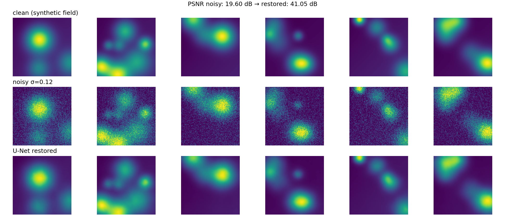
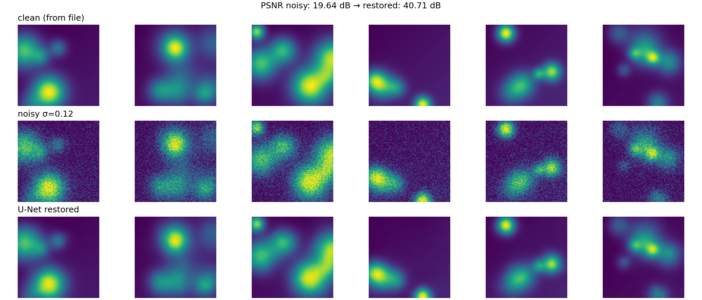
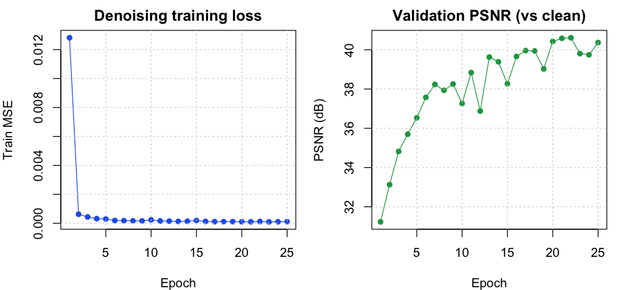

# Image restoration lab

Small demo that ties together **PyTorch**, **Hugging Face Transformers**, synthetic **mechanics-flavored** 2D fields (smooth scalar “slices” you might get from CFD/postprocessing), **optional super-resolution**, a minimal **R** plotting script, and a tiny **open-weights language model** example (DistilGPT-2).

It does **not** run FEM, SPH, or a CFD solver; it is meant as a bridge project between your simulation/visualization world and modern ML tooling. You can swap the synthetic tensors for PNG exports from a C++ or Python postprocessor.

## Results

Figures below are generated by `train.py` / `infer.py` (or `./scripts/demo.sh`). Re-run locally to refresh; the repo is set up so **`outputs/*.png` and `outputs/metrics.csv` can be committed** and render on GitHub.

### Denoising — synthetic fields

### Denoising — from sample PNGs (`sample_data/field_*.png`)

### Training metrics (optional — after `cd r && Rscript plot_metrics.R`)

